```mermaid
%%{init: {'theme': 'dark', 'themeVariables': {'primaryColor': '#00FF88', 'primaryTextColor': '#fff', 'primaryBorderColor': '#00E6FF', 'lineColor': '#C800FF', 'secondaryColor': '#0D0D1A', 'tertiaryColor': '#0D0D1A'}}}%%
graph LR
    A[🍴 Fork Repo] --> B[🌿 Create Branch]
    B --> C[💻 Write Code]
    C --> D[📝 Commit Changes]
    D --> E[🚀 Push Branch]
    E --> F[🎉 Open PR]

    style A fill:#0D0D1A,stroke:#00FF88,stroke-width:2px,color:#00FF88
    style B fill:#0D0D1A,stroke:#00E6FF,stroke-width:2px,color:#00E6FF
    style C fill:#0D0D1A,stroke:#5078FF,stroke-width:2px,color:#5078FF
    style D fill:#0D0D1A,stroke:#C800FF,stroke-width:2px,color:#C800FF
    style E fill:#0D0D1A,stroke:#FFE600,stroke-width:2px,color:#FFE600
    style F fill:#0D0D1A,stroke:#FF3C3C,stroke-width:2px,color:#FF3C3C
```

<div align="center">

<!-- ═══════════════════ ANIMATED WAVE HEADER ═══════════════════ -->


<!-- ═══════════════════ ANIMATED TYPING BANNER ═══════════════════ -->
<br>
<a href="https://github.com/samay825/ZorkOS-Termux">
  
</a>
<br><br>

<!-- ═══════════════════ ANIMATED BADGES ROW 1 ═══════════════════ -->
<a href="https://github.com/samay825/ZorkOS-Termux/stargazers">
  
</a>
&nbsp;
<a href="https://github.com/samay825/ZorkOS-Termux/network/members">
  
</a>
&nbsp;
<a href="https://github.com/samay825/ZorkOS-Termux/issues">
  
</a>
&nbsp;
<a href="https://github.com/samay825/ZorkOS-Termux/blob/main/LICENSE">
  
</a>

<br><br>

<!-- ═══════════════════ TECH CAPSULE BADGES ═══════════════════ -->

&nbsp;

&nbsp;

&nbsp;


<br><br>

<!-- ═══════════════════ VISITOR COUNTER + ACTIVITY ═══════════════════ -->

&nbsp;


<br>

<!-- ═══════════════════ ANIMATED LINE ═══════════════════ -->


</div>

<!-- ═══════════════════════════════════════════════════════════════════ -->
<!--                        ABOUT SECTION                              -->
<!-- ═══════════════════════════════════════════════════════════════════ -->

<div align="center">

##  &nbsp; What is ZorkOS? &nbsp; 

</div>

<table align="center">
<tr>
<td>

```
 ╔══════════════════════════════════════════════════════════════╗
 ║                                                              ║
 ║   ZorkOS is an all-in-one Termux terminal customization      ║
 ║   framework that transforms your boring Android terminal     ║
 ║   into a CYBERPUNK-STYLED POWERHOUSE.                        ║
 ║                                                              ║
 ║   One single command installs everything:                    ║
 ║   → Themes, Animations, Plugins, Fonts, Colors              ║
 ║   → 17+ Feature Modules  |  140+ ZSH Themes                 ║
 ║   → Security System  |  Achievement Engine                   ║
 ║                                                              ║
 ║   ⚡ No root required  ⚡ No bloat  ⚡ Pure power            ║
 ║                                                              ║
 ╚══════════════════════════════════════════════════════════════╝
```

</td>
</tr>
</table>

<br>

<!-- ═══════════════════════════════════════════════════════════════════ -->
<!--                     QUICK INSTALL SECTION                         -->
<!-- ═══════════════════════════════════════════════════════════════════ -->

<div align="center">

##  &nbsp; Quick Install &nbsp; 


</div>

<br>

```bash
git clone https://github.com/samay825/ZorkOS-Termux && cd ZorkOS-Termux && chmod +x * && ./install.sh
```

<div align="center">
<br>

> **📱 Restart Termux after installation and experience the transformation!**

<br>

</div>

<!-- ═══════════════════════════════════════════════════════════════════ -->
<!--                       FEATURES SECTION                            -->
<!-- ═══════════════════════════════════════════════════════════════════ -->

<div align="center">

##  &nbsp; Feature Arsenal &nbsp; 


</div>

<br>

<!-- ─────────── 🎨 CUSTOMIZATION ─────────── -->
<details>
<summary><h3>🎨 &nbsp; Customization Engine &nbsp; <sup></sup></h3></summary>

<div align="center">

|  | Feature | Description |
|:---:|:---|:---|
| 🎭 | **140+ ZSH Themes** | `zork-2026` `zork-neon` `zork-minimal` + full Oh-My-Zsh library |
| 🌈 | **6 Color Schemes** | Zork Default · Cyber Neon · Blood Matrix · Ocean Depth · Aurora · Sunset |
| ✏️ | **8 Nerd Fonts** | FiraCode · JetBrainsMono · Hack · MesloLGS · CascadiaCode & more |
| 🔮 | **Gradient Engine** | Truecolor RGB gradients on text, banners, separators |
| 📐 | **Responsive UI** | Auto-adapts to any screen — phone, tablet, DEX mode |

</div>
</details>

<!-- ─────────── ✨ ANIMATIONS ─────────── -->
<details>
<summary><h3>✨ &nbsp; Boot & Animations &nbsp; <sup></sup></h3></summary>

<div align="center">

|  | Feature | Description |
|:---:|:---|:---|
| 🌀 | **7 Boot Animations** | Matrix Rain · Cyber Grid · Hex · DNA Helix · Glitch · Particle · Minimal |
| 🏴 | **Custom Banners** | 10+ ASCII art styles with gradient rendering |
| 🔊 | **Boot Sound** | MP3 playback on startup via mpv/ffplay/termux-api |
| 📊 | **MOTD Dashboard** | System info · weather · XP level · streak — every login |

</div>
</details>

<!-- ─────────── 🛡️ SECURITY ─────────── -->
<details>
<summary><h3>🛡️ &nbsp; Security Suite &nbsp; <sup></sup></h3></summary>

<div align="center">

|  | Feature | Description |
|:---:|:---|:---|
| 🔐 | **Auth System v3.0** | Multi-user login with SHA-256 hashed passwords |
| ⏰ | **Idle Auto-Lock** | Configurable timeout auto-locks the terminal |
| 🚫 | **Login Lockout** | 5 failed attempts = 5 min lockout protection |
| 🔒 | **Terminal Lock** | Password gate on shell startup |
| 🎫 | **Session Manager** | Secure tokens with activity tracking |

</div>
</details>

<!-- ─────────── 🏆 GAMIFICATION ─────────── -->
<details>
<summary><h3>🏆 &nbsp; Gamification & Productivity &nbsp; <sup></sup></h3></summary>

<div align="center">

|  | Feature | Description |
|:---:|:---|:---|
| 🥇 | **Achievement System** | 24 unlockable achievements with XP rewards |
| 📈 | **XP & Leveling** | NOOB → BEGINNER → ... → LEGENDARY progression |
| 🔥 | **Login Streaks** | Daily tracking with milestone rewards |
| 🍅 | **Pomodoro Timer** | Focus sessions with cyberpunk UI + XP rewards |
| 📝 | **Quick Notes** | Tag-based notes with search |
| 📌 | **Dir Bookmarks** | Save/jump directories with FZF integration |

</div>
</details>

<!-- ─────────── 💀 POWER FEATURES ─────────── -->
<details>
<summary><h3>💀 &nbsp; Power Features &nbsp; <sup></sup></h3></summary>

<div align="center">

|  | Feature | Description |
|:---:|:---|:---|
| 💚 | **Hacker Mode** | Full green-on-black matrix terminal theme |
| 🖥️ | **Screensaver** | Matrix rain · digital clock · starfield · pipes |
| 📊 | **Live Dashboard** | CPU · RAM · disk · battery · network — realtime |
| 🌤️ | **Weather Widget** | Current weather in prompt (auto-cached) |
| 💾 | **Backup & Restore** | Full config backup/restore system |
| 🔌 | **Plugin Manager** | Install/enable/disable Oh-My-Zsh plugins |

</div>
</details>


<div align="center">

</div>

<!-- ═══════════════════════════════════════════════════════════════════ -->
<!--                      CLI COMMANDS                                 -->
<!-- ═══════════════════════════════════════════════════════════════════ -->

<div align="center">

##  &nbsp; CLI Commands &nbsp; 


</div>

<br>

<div align="center">
<table>
<tr>
<td>

**🎯 Core Commands**
```bash
zork                  # Open main menu
zork help             # Full command list
```

</td>
<td>

**🎨 Appearance**
```bash
zork theme [name]     # Switch ZSH theme
zork color [name]     # Switch color scheme
zork boot [style]     # Set boot animation
zork sound on|off     # Toggle boot sound
```

</td>
</tr>
<tr>
<td>

**📊 Monitoring**
```bash
zork dash             # System dashboard
zork dashlive         # Live system monitor
zork weather          # Weather display
```

</td>
<td>

**💀 Power Modes**
```bash
zork hack on|off      # Toggle hacker mode
zork ss [style]       # Launch screensaver
zork plugin           # Plugin manager
```

</td>
</tr>
<tr>
<td>

**🏆 Productivity**
```bash
zork pomo             # Start 25min pomodoro
zork pomo quick N     # Quick N-minute timer
zork note add MSG     # Add a quick note
zork note list        # List all notes
```

</td>
<td>

**⚙️ System**
```bash
zork bm save [n]      # Bookmark current dir
zork bm go NAME       # Jump to bookmark
zork xp               # View achievements
zork xp stats         # XP & level summary
zork auth             # Security settings
zork backup           # Create backup
```

</td>
</tr>
</table>
</div>

<br>

<div align="center">

</div>

<!-- ═══════════════════════════════════════════════════════════════════ -->
<!--                      COLOR SCHEMES                                -->
<!-- ═══════════════════════════════════════════════════════════════════ -->

<div align="center">

##  &nbsp; Color Schemes &nbsp; 

</div>

<br>

<div align="center">
<table>
<tr>
<td align="center">

**🟢 Zork Default**
<br>


</td>
<td align="center">

**💜 Cyber Neon**
<br>


</td>
<td align="center">

**🔴 Blood Matrix**
<br>


</td>
</tr>
<tr>
<td align="center">

**🔵 Ocean Depth**
<br>


</td>
<td align="center">

**🟢 Aurora Borealis**
<br>


</td>
<td align="center">

**🟠 Sunset Blaze**
<br>


</td>
</tr>
</table>
</div>

<br>

<div align="center">

</div>

<!-- ═══════════════════════════════════════════════════════════════════ -->
<!--                      REQUIREMENTS                                 -->
<!-- ═══════════════════════════════════════════════════════════════════ -->

<div align="center">

##  &nbsp; Requirements &nbsp; 

</div>

<br>

<div align="center">
<table>
<tr>
<td align="center" width="33%">


<br><br>
**Android 7+**
<br>
<sub>Any Android device</sub>

</td>
<td align="center" width="33%">


<br><br>
**First Install Only**
<br>
<sub>Works offline after setup</sub>

</td>
<td align="center" width="33%">


<br><br>
**Zero Root**
<br>
<sub>100% rootless operation</sub>

</td>
</tr>
</table>
</div>

<br>

<details>
<summary><b>📦 Auto-installed Packages</b></summary>
<br>
<div align="center">


</div>
</details>

<br>

<div align="center">

</div>

<!-- ═══════════════════════════════════════════════════════════════════ -->
<!--                     UPDATE & UNINSTALL                            -->
<!-- ═══════════════════════════════════════════════════════════════════ -->

<div align="center">

##  &nbsp; Update & Uninstall &nbsp; 

</div>

<br>

<div align="center">
<table>
<tr>
<td align="center" width="50%">

### 🔄 Update

**Via Menu:**
```
zork → Option 13 → Update
```

**Manual:**
```bash
cd ZorkOS-Termux && git pull && ./install
```

</td>
<td align="center" width="50%">

### 🗑️ Uninstall

**Via Menu:**
```
zork → Option 14 → Uninstall
```

**Manual:**
```bash
rm -rf ~/.zorkos ~/.oh-my-zsh
rm -f ~/.zshrc
rm -f $PREFIX/bin/zork
chsh -s bash
```

</td>
</tr>
</table>
</div>

<br>

<div align="center">

</div>

<!-- ═══════════════════════════════════════════════════════════════════ -->
<!--                      CONTRIBUTING                                 -->
<!-- ═══════════════════════════════════════════════════════════════════ -->

<div align="center">

##  &nbsp; Contributing &nbsp; 

</div>

<br>



```bash
# 1. Fork the repository
# 2. Create your feature branch
git checkout -b feature/your-feature

# 3. Commit your changes
git commit -m '✨ Add your awesome feature'

# 4. Push to the branch
git push origin feature/your-feature

# 5. Open a Pull Request 🎉
```

<br>

<div align="center">

</div>

<!-- ═══════════════════════════════════════════════════════════════════ -->
<!--                         CONTACT                                   -->
<!-- ═══════════════════════════════════════════════════════════════════ -->

<div align="center">

##  &nbsp; Connect With Us &nbsp; 

<br>

<a href="https://instagram.com/sincryptzork">
  
</a>
&nbsp;&nbsp;
<a href="https://t.me/quickbreach">
  
</a>
&nbsp;&nbsp;
<a href="https://youtube.com/@quickbreachofficial">
  
</a>

<br><br>

<!-- ═══════════════════ STAR HISTORY ═══════════════════ -->

### ⭐ Star History

<a href="https://star-history.com/#samay825/ZorkOS-Termux&Date">
  <picture>
    <source media="(prefers-color-scheme: dark)" srcset="https://api.star-history.com/svg?repos=samay825/ZorkOS-Termux&type=Date&theme=dark" />
    <source media="(prefers-color-scheme: light)" srcset="https://api.star-history.com/svg?repos=samay825/ZorkOS-Termux&type=Date" />
    
  </picture>
</a>

</div>

<br>

<!-- ═══════════════════════════════════════════════════════════════════ -->
<!--                     ANIMATED FOOTER                               -->
<!-- ═══════════════════════════════════════════════════════════════════ -->


<div align="center">


<br>


&nbsp;

&nbsp;


<br><br>

**If you like this project, smash that ⭐ button — it means the world! 🌍**

<br>


</div>
